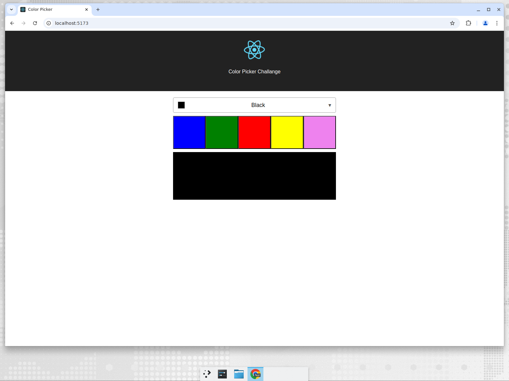

# 🎨 ReactColorPickerDemo

**ReactColorPickerDemo is a small React single-page app that lets you pick a color from a dropdown or a row of buttons and instantly see it rendered in a preview panel.**

It is a teaching/demo project: it shows how parent state flows down to child components through props (unidirectional data flow) in a minimal, easy-to-read codebase, built with [Vite](https://vitejs.dev/) and tested with [Vitest](https://vitest.dev/).




---

## 📚 Table of Contents

- [Who is this for?](#-who-is-this-for)
- [Requirements](#-requirements)
- [Quick start](#-quick-start)
- [Available scripts](#-available-scripts)
- [Project structure](#-project-structure)
- [How it works](#-how-it-works)
- [Deployment](#-deployment)
- [Contributing](#-contributing)
- [License](#-license)

---

## 👥 Who is this for?

Developers learning React — or reviewers of this demo — who want a working example of component composition and state lifting without the noise of a large application. No backend, database, or API keys are required.

---

## ✅ Requirements

| Tool | Version | Notes |
| --- | --- | --- |
| [Node.js](https://nodejs.org/) | **22 or newer** (see [`.nvmrc`](.nvmrc)) | Vite 8 and Vitest 4 require Node 22+; older versions fail to start. |
| npm | Ships with Node 22 | The repo has a `package-lock.json`, so npm is the supported package manager. Yarn is not used here — using it would ignore the lockfile. |

```bash
# If you use nvm, pick the version pinned in .nvmrc
nvm use
```

---

## 🚀 Quick start

```bash
# 1. Clone the repository
git clone https://github.com/david071197/ReactColorPickerDemo.git
cd ReactColorPickerDemo

# 2. Install dependencies exactly as locked (use `npm install` if you need to change deps)
npm ci

# 3. Start the dev server on http://localhost:5173
npm start
```

Then open <http://localhost:5173> in your browser.

To check a production build locally:

```bash
npm run build     # outputs static files to build/
npm run preview   # serves build/ on a local port
```

---

## 🧰 Available scripts

| Command | What it does |
| --- | --- |
| `npm start` / `npm run dev` | Starts the Vite dev server with hot module replacement. |
| `npm test` | Runs the Vitest suite once (jsdom environment). |
| `npm run build` | Creates the optimized production bundle in `build/`. |
| `npm run preview` | Serves the contents of `build/` for a final check. |

---

## 🗂 Project structure

```text
.
├── index.html          # Vite entry HTML (loads src/main.jsx)
├── vite.config.js      # Vite + React plugin config; build output goes to build/
├── src/
│   ├── main.jsx        # React root, mounts <App />
│   ├── App.jsx         # App, ColorPicker, ColorDropdown and ColorContainer components
│   ├── App.test.jsx    # Smoke test: renders the app without crashing
│   ├── App.css         # Layout, swatches and dropdown styles
│   ├── index.css       # Global base styles
│   └── logo.svg        # React logo used in the header
├── public/             # Static assets copied as-is (favicon, manifest, SWA config)
├── docs/               # Images used by the documentation
└── .github/workflows/  # CI (build, test, npm audit) and Azure Static Web Apps deploy
```

---

## 🧩 How it works

- **`ColorPicker`** is the single source of truth: it holds the selected color in its state (`"black"` by default).
- **`ColorDropdown`** and the color buttons are inputs — they call back into `ColorPicker` to change the state.
- **`ColorContainer`** is a presentational component that receives the color as a prop and renders the preview panel.

```jsx
// Simplified: state lives in the parent, children receive props
<ColorDropdown color={this.state.color} onChange={(color) => this.setState({ color })} />
<ColorContainer color={this.state.color} />
```

Colors are applied via CSS classes (`color-blue`, `color-green`, …) defined in `src/App.css`, so adding a color means adding it to the `COLORS` list in `src/App.jsx` plus a matching CSS class.

---

## ☁️ Deployment

Pushes and pull requests targeting `master` trigger two GitHub Actions workflows:

- [`ci.yml`](.github/workflows/ci.yml) — installs dependencies, runs the tests, builds the app and fails on high-severity `npm audit` findings.
- [`azure-static-web-apps-mango-flower-00e2aa010.yml`](.github/workflows/azure-static-web-apps-mango-flower-00e2aa010.yml) — builds and deploys to Azure Static Web Apps, and creates a temporary preview environment for each open pull request.

Security headers (CSP, HSTS, `X-Frame-Options`, …) served in production are defined in [`public/staticwebapp.config.json`](public/staticwebapp.config.json).

---

## 🤝 Contributing

Issues and pull requests are welcome. There is no `CONTRIBUTING.md`, so please:

1. Create a branch from `master`.
2. Keep changes focused and match the existing code style.
3. Run `npm test` and `npm run build` before opening the pull request.
4. Open the pull request against `master` and wait for CI plus the Azure preview environment.

---

## 📄 License

This repository is a private demo (`"private": true` in [`package.json`](package.json)) and currently ships **no LICENSE file**, so no usage rights are granted by default. If you want to reuse the code, please open an issue to ask the maintainer to add an explicit license.

---

🇪🇸 ¿Prefieres español? Lee el [README en español](README_ES.md).

_Originally written and maintained by contributors and [Devin](https://app.devin.ai), with updates from the core team._
